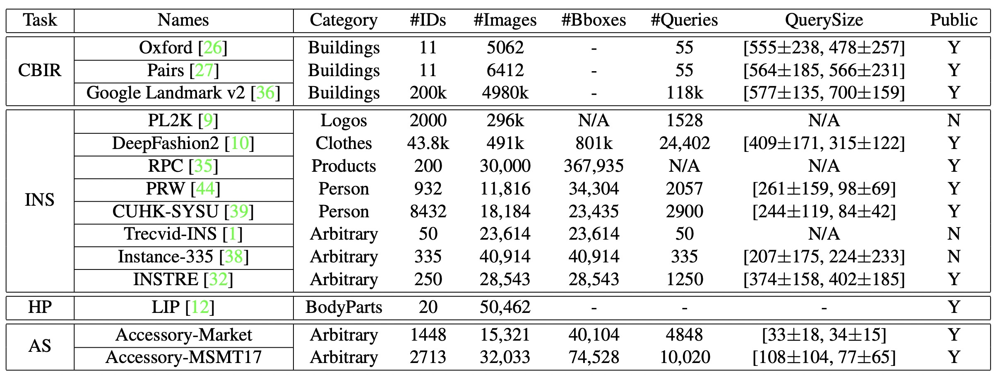

# Accessory Search

This repo has the source code for the paper "JEDI: Joint accEssory Discovery and re-Identification (JEDI) for Accessory Search". Including:

> the annotation of Accessory-Market

> the annotation of Accessory-MSMT17

> the evaluation code of Accessory-Search task
================================================================

## Annotation

* Please download original images from [Market1501](http://zheng-lab.cecs.anu.edu.au/Project/project_reid.html) and MSMT17. The image name and person id of each accessory is consistance with original reid data. 

* We provide txt files for annotation in folder annotation. The annotation is formatted as [ImageName, [left, top, right, bottom], AccessoryId, IsQuery].     
  * The Accessory-Market dataset has 40104 object bounding boxes which is classified to 1448 object ids.
  * The Accessory-MSMT17 dataset has 74528 object bounding boxes which is classified to 2713 object ids.
  

* For more information, feel free to contack us at accessory_search@163.com. 

================================================================

## Evaluation

Comming soon......

================================================================

## Leardboard

Comming soon......
